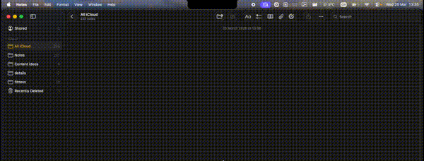

<div align="center">

# notchpets

</div>

<p align="center">
    A macOS notch companion app where pixel art pets live in your MacBook's notch. Pair with a partner to see each other's pets side by side, send messages, and share what you're listening to — all in real time.
    <br>
    <br>
    <a href="https://github.com/tri27pham/notchpets/issues/new?labels=bug&title=">Report a Bug</a>
    ·
    <a href="https://github.com/tri27pham/notchpets/issues/new?labels=feature&title=">Request Feature</a>
</p>

<p align="center">
    
</p>

## Table of Contents

- [Features](#features)
- [Installation](#installation)
- [Usage](#usage)
- [Pairing](#pairing)
- [Tech Stack](#tech-stack)
- [Setup for Development](#setup-for-development)
- [Project Structure](#project-structure)
- [Credits](#credits)

## Features

- **6 Pet Species** — Cat, Dog, Frog, Panda, Penguin, Rabbit
- **9 Pixel Art Backgrounds** — Bedroom, Rainy Window, Forest, Mount Fuji, Cafe, Beach, Library, Snowy Field, Japan
- **Spritesheet Animations** — Idle, happy, eating, playing, sleeping, sad, dancing, running, jumping, catching ball
- **Ball Throw Mini-Game** — Toss a ball and watch your pet chase, catch, and return it
- **Partner Pairing** — Connect with someone via 6-character invite codes. Both pets appear side by side in the notch
- **Real-Time Sync** — Pet stats, messages, and music sync instantly between paired users via Supabase Realtime
- **Now Playing Detection** — Detects music playback via macOS MediaRemote and shows a now-playing bubble. Works with Spotify, Apple Music, and more
- **Messaging** — Send short messages that appear as pixel art speech bubbles above your pet
- **Pet Stats** — Hunger and happiness decay over time. Feed, play, and interact to keep your pet happy
- **Click Interactions** — Tap for happy bounce, double-tap for play/dance animations

## Installation

Download the latest `.dmg` from [Releases](https://github.com/tri27pham/notchpets/releases).

> **Requires** macOS 13 Ventura or later on a MacBook with a notch (MacBook Pro 14"/16", MacBook Air M2+).

## Usage

1. **Launch** — The app creates a borderless panel positioned over the MacBook notch. It runs as a menu-bar-only app (no Dock icon).
2. **Hover** — Mouse over the notch to expand the panel and reveal your pet.
3. **Interact** — Click your pet, feed it, play with it, or throw a ball.
4. **Pair** — Open settings, create an invite code, and share it with your partner.
5. **Connect** — Once paired, both pets appear side by side with real-time stat, message, and music sync.

## Pairing

1. One user taps **Create code** in settings — generates a 6-character invite code.
2. The other user taps **Enter code** and submits it.
3. Both users' pets appear side by side with real-time sync.

For persistent identity across devices, users can sign in via magic link email.

## Tech Stack

| Component | Technology |
|-----------|------------|
| UI | SwiftUI + AppKit (NSPanel) |
| Pet Rendering | SpriteKit (spritesheet animation) |
| Backend | Supabase (Postgres, Auth, Realtime) |
| Music Detection | macOS MediaRemote framework |
| Session Storage | macOS Keychain |
| Auto-Updates | Sparkle framework |

## Setup for Development

### Prerequisites

- Xcode (latest) with Swift 5.9+
- macOS with a notch (MacBook Pro 14"/16", MacBook Air M2+)
- A [Supabase](https://supabase.com) project

### Supabase Configuration

1. Create a Supabase project
2. Run the migrations in `supabase/migrations/` to set up the database tables (`pets`, `pairs`, `invites`)
3. Deploy the edge functions in `supabase/functions/` (`pet-decay`, `invite-cleanup`)
4. Create `notchpets/notchpets/Config.plist` with your credentials:

```xml
<?xml version="1.0" encoding="UTF-8"?>
<!DOCTYPE plist PUBLIC "-//Apple//DTD PLIST 1.0//EN"
  "http://www.apple.com/DTDs/PropertyList-1.0.dtd">
<plist version="1.0">
<dict>
    <key>SUPABASE_URL</key>
    <string>https://your-project.supabase.co</string>
    <key>SUPABASE_ANON_KEY</key>
    <string>your-anon-key</string>
</dict>
</plist>
```

### Build & Run

```bash
git clone https://github.com/tri27pham/notchpets.git
cd notchpets
open notchpets/notchpets.xcodeproj
# Build and run (Cmd+R)
```

## Project Structure

```
notchpets/
├── App/                  # Entry point, AppDelegate
├── Window/               # NSPanel, window controller, notch metrics
├── Views/                # PanelView, PetSlotView, SettingsView, NotchShape
├── Pet/                  # PetScene, PetSpriteNode, AnimationState, MusicDetector
├── Data/                 # Models, PetStore, PetRepository, SupabaseManager
├── Auth/                 # AuthManager (anonymous + magic link)
├── Storage/              # KeychainService
├── Shared/               # Constants, PanelState
└── Assets.xcassets/      # Spritesheets, backgrounds, app icon
```

## Debug

In `DEBUG` builds, the settings panel includes a **"Add mock partner"** button to simulate a paired state without needing a second instance or Supabase connection.

